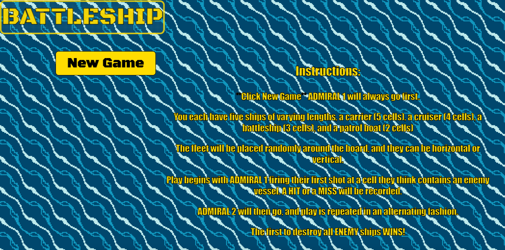
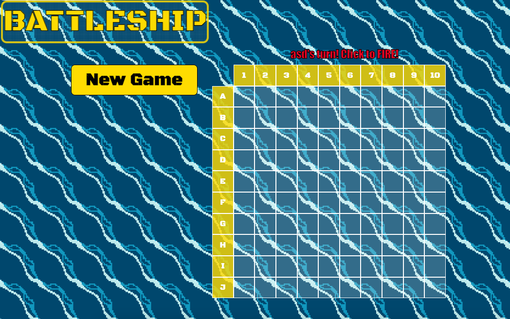

The classic game of Battleship!
You'll play two player, but the ships are automatically placed at random for you.
The first player will select a grid location where they believe their enemy vessels are. If it's a hit, you'll see an explosion or a miss and the grid will keep track of which cells have been selected.
After the first hit or miss, the second player goes, and then on and on until a player eliminates all enemy vessels. That person is the winner!
Click here to play: https://padcoding1.github.io/project1-battleship/

